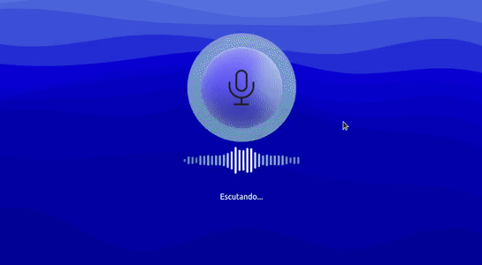

# Song Identifier
<i>Uma aplicação que reconhece qual música está tocando no ambiente e disponibiliza links pra plataformas de streaming(Spotify, iTunes, Deezer, Youtube, etc.) </i>
 

<h1>Instalação</h1>
Caso queira rodá-lo na sua máquina, primeiro faça o git clone, depois instale as depêndencias necessárias.
 
<code>git clone</code>
 
<code>cd songidentifier</code>
 
<code>npm install</code>
 
 
Para executar o app:

<code>npm start</code>
 
 

# 🚀Tecnologias e Ferramentas utilizadas:
<h1 align='left'>

</h1>

# Habilidades e aprendizados
- Solicitar acesso ao microfone e gravar áudio. 
- Manipular dados providos pelo microfone do usuário.
- Conceito de `blob` e `buffer`.
- Criar arquivo a partir de um `blob`.
- Implementar um `visualizador de áudio` do microfone utilizando `Vanilla Javascript`.
